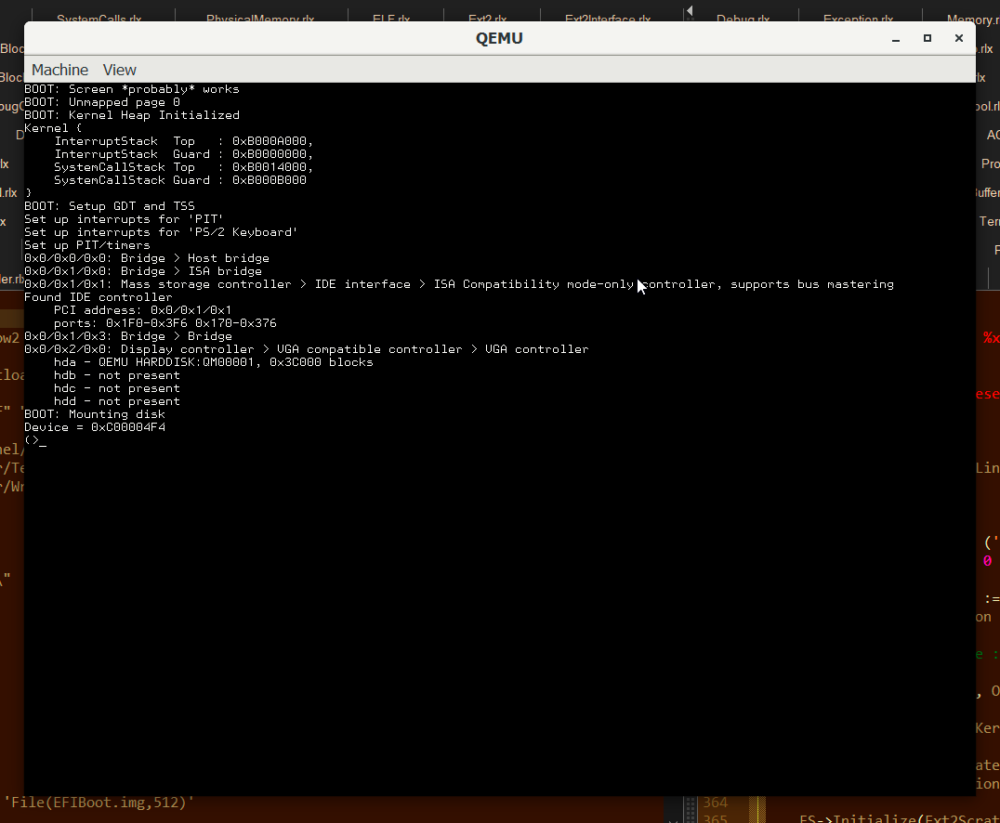
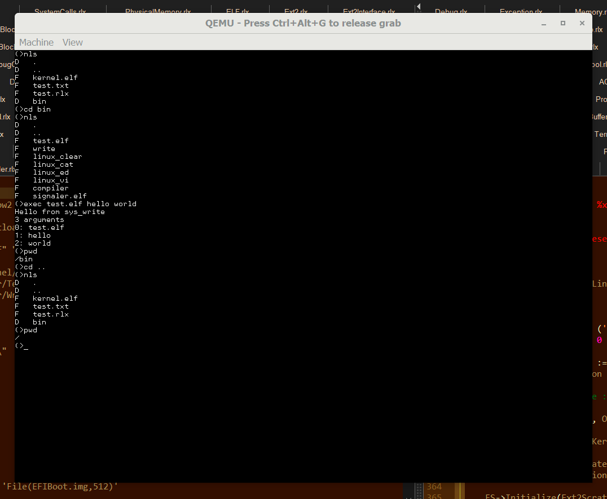
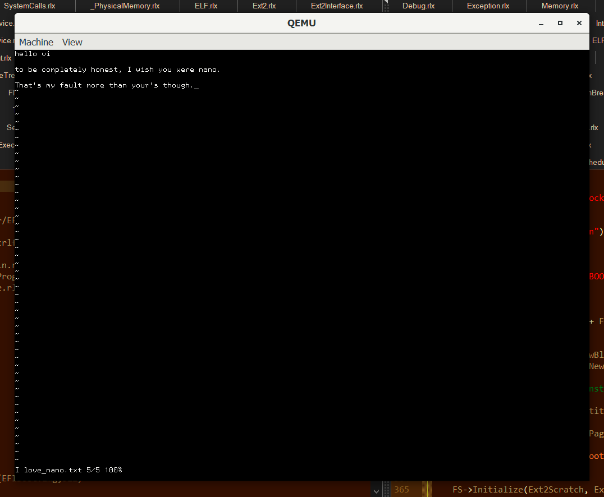
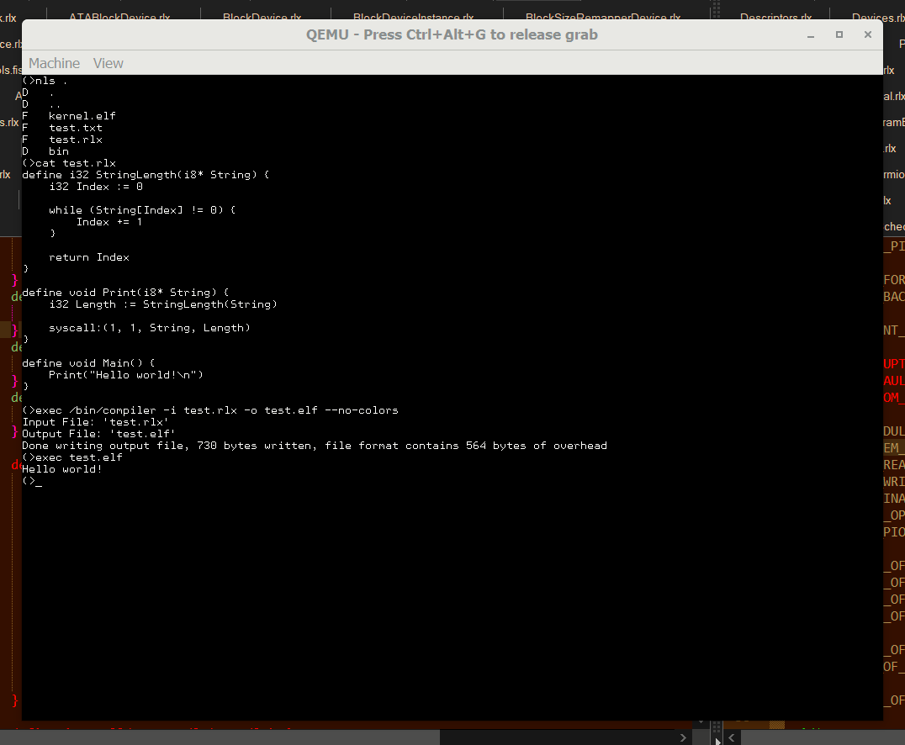

# Unnamed hobby OS

## Screenshots

Post-boot screen:



A few simple builtin commands:



`vi` from busybox running:



Compiling and running a program:



## "Features"

* EFI Bootloader
* 64 bit kernel
* Entirely homemade toolchain (compiler, bootloader, disk image utilities)
* Only crashes sometimes.
* Can detect up to ***4*** disks (but only uses one)
* Has a custom font (which isn't used anymore, because I'm not very good at drawing characters)
* Support for nearly any Windows 2.0/3.1 bit-mapped font. What's not to love about fonts for 16 bit machines on a 64 bit one?
* Can multitask. Hopefully. I haven't tested it beyond flashing the cursor.

## Boring stuff

Expects to be cloned with the structure
* any-name/
    * src/
        * \<this-repo\>
    * build/
        * Nothing, just needs to exist for compiled binaries

Additionally, a few tools need to be built on the host to actually build a disk image (since nasm is the only external program used).

This can be done with the script `src/build_host_tools.rlx`, which builds:

* `Ext2Tool.elf` - which uses the full Ext2 driver to build disk images from user mode
* `Fat32Tool.elf` - same as Ext2Tool, but with FAT32 instead (for EFI system partitions)
* `GPTTool.elf` - same concept as the previous two, but imports other images as partitions in a new GPT partitioned disk image

Next, build with `source ./src/efi_build.fish`, which will:

* compile the EFI bootloader
* compile the kernel
* compile user mode test programs

and then

* create a 120mb GPT disk image with 2 paritions (70mb EFI system, 50mb OS root)
* format the EFI system partition as FAT32
* import the EFI bootloader to `\EFI\BOOT\BOOTX64.EFI`
* format the root partition as Ext2
* import the kernel executable to `kernel.elf`
* import test files

which will then get `./build/EFIBoot.img` (hopefully) ready to boot.

---

At any step, the `XXXXTool.elf` binaries can be used to inspect the created image, and should be invoked as

```
./GPTTool.elf 'File(EFIBoot.img,512)'
```

or (for the FS specific tools)

```
./XXXXTool.elf 'File(EFIBoot.img,512)>GPT(N)'
```

where `N` is a partition number either 0 or 1 (EFI system/OS root).

## Configuration

(Spoiler: there isn't much)

All configuration lives in `./src/kernel/Config.rlx`.

* `USE_BOCHS_PORT_HACK` - print debug info to the Bochs console via a magic instruction.
* `USE_SERIAL_OUTPUT`/`SERIAL_OUTPUT_PORT` - print debug info over a serial port, assuming serial port `N` exists.
* `TERMINAL_FOREGROUND`/`TERMINAL_BACKGROUND` - default terminal foreground/background colors. You'll want to change these since I prefer a black on white look.
* `BOOT_FONT_FON` - a `.fon` file for the default terminal font, must be a version 2/3 bitmap `FON` file.
* `DEBUG_XXXX` - debug flags, will print lots of info to the debug port (either Bochs or serial, or none if neither are enabled). Not recommended, especially since printing to a serial port can be very slow and some debug events fire every 10ms (or on every system call).

## Other

The FAT32 driver doesn't actually support long file names, and only works with 8.3. Thankfully, EFI implementations don't really care, and since `\EFI\BOOT\BOOTX64.EFI` are all 8.3 form by default, this isn't a problem. Just don't expect the driver to handle non 8.3 file systems correctly.

The generated partition/FS UUIDs are not random, and are only psuedorandom when generated in one session of `GPTTool.elf`.

The Ext2 driver isn't super well optimized, and a majority of the work done in the bootloader is actually just reading the kernel.

Control+C (while properly sending SIGINT) will crash if ran in the shell due to a very obscure bug.
